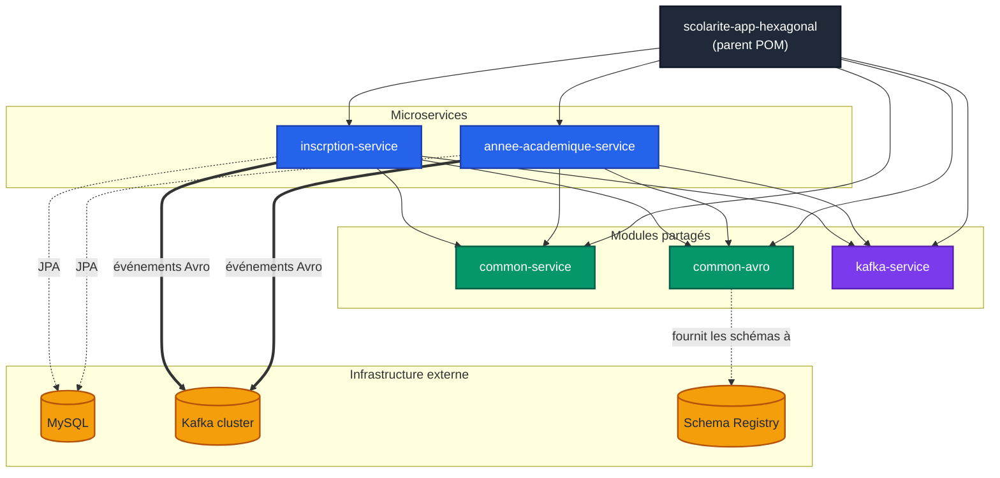
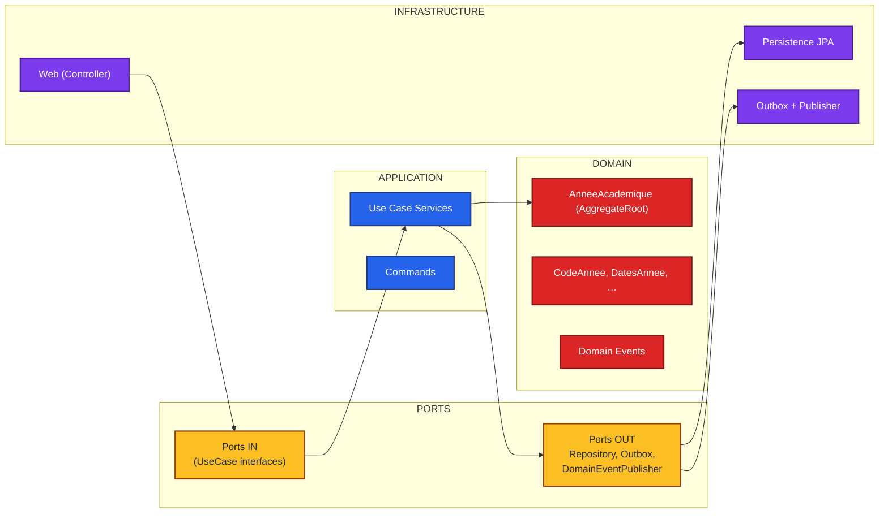
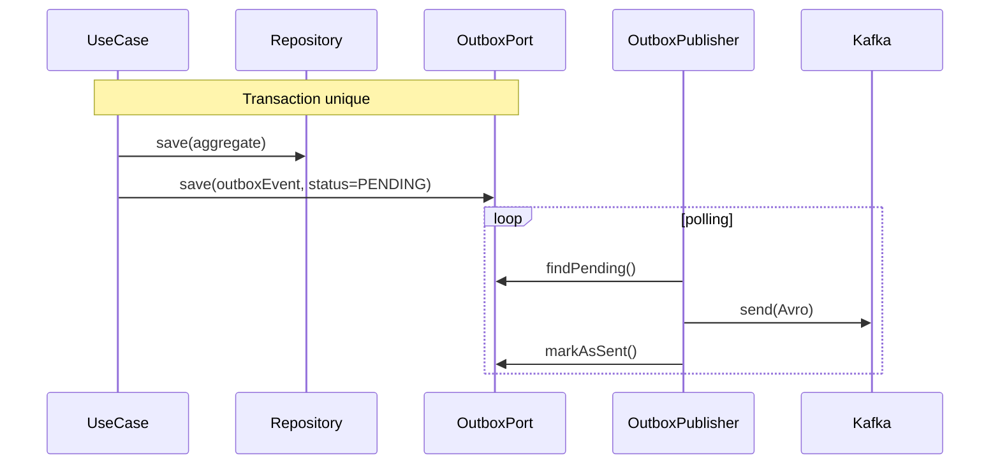
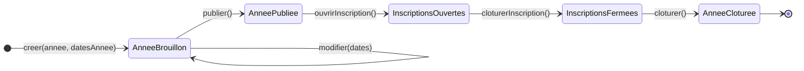
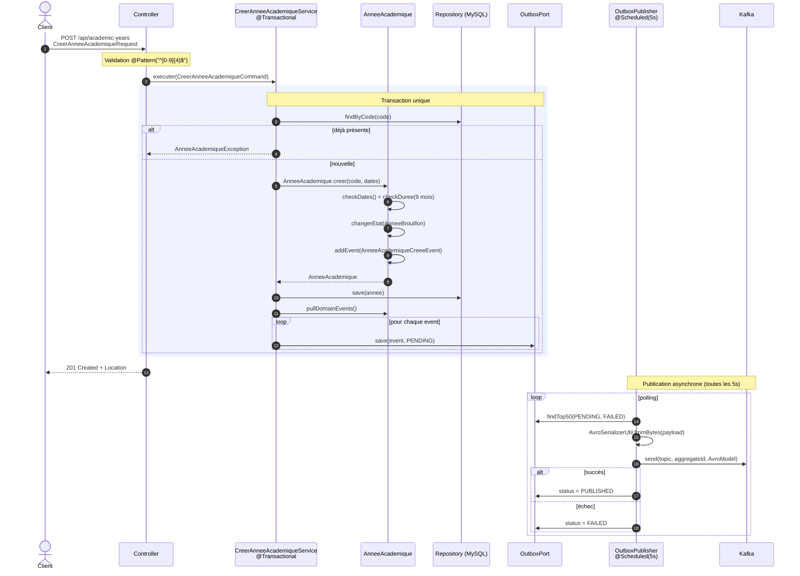
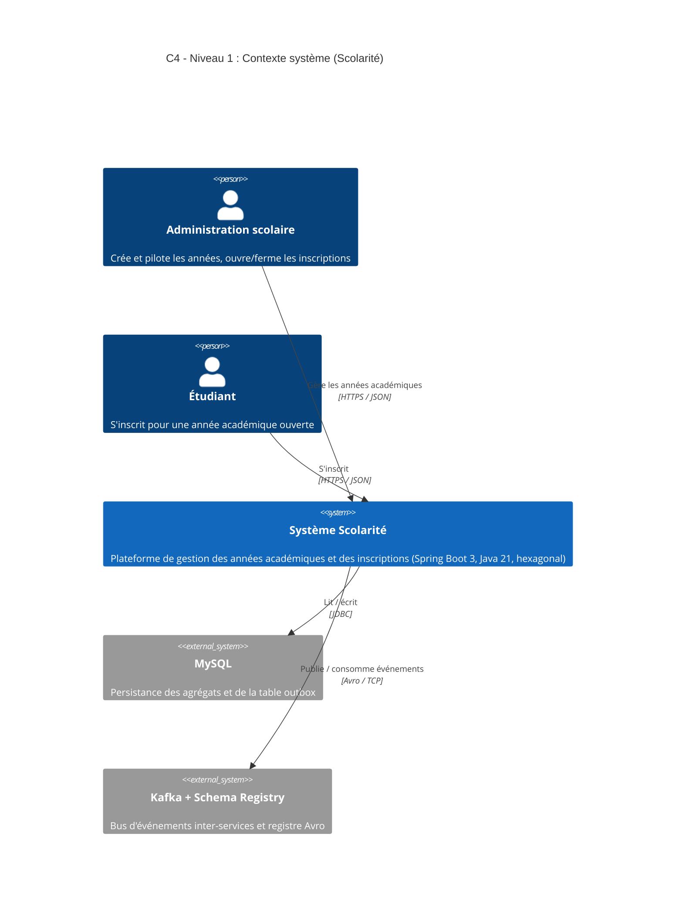
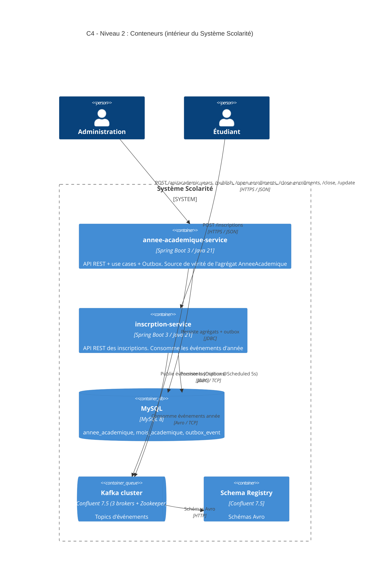
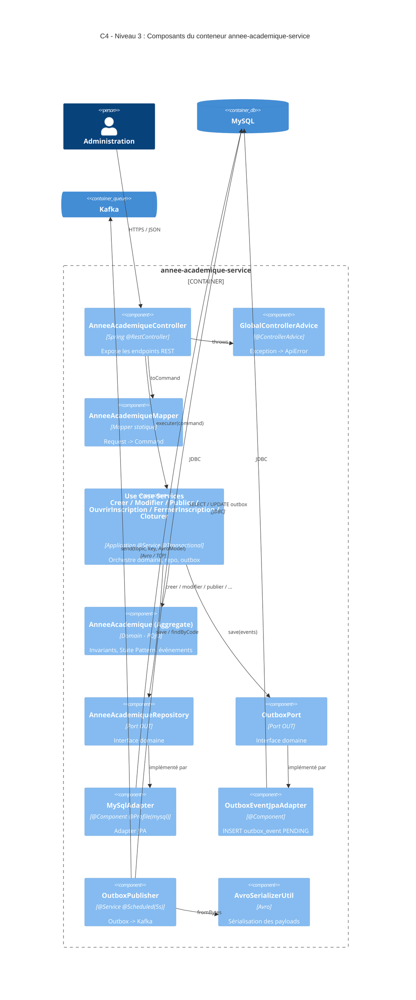

# Architecture — scolarite-app-hexagonal

Multi-module **Maven** / **Spring Boot 3** / **Java 21**, suivant une **architecture hexagonale** (DDD) avec communication inter-services via **Kafka** et **Outbox Pattern**.

## 1. Modules Maven & dépendances

| Module | Rôle |
|---|---|
| `common-service` | Briques DDD partagées : `BaseEntity`, `AggregateRoot`, `BaseId`, `DomainEvent`, `DomainEventPublisher`, `DomainException`, `DomainConstants` |
| `common-avro` | Schémas Avro (`*.avsc`) + classes Java générées par `avro-maven-plugin` |
| `kafka-service` | Producteur / Consommateur Spring Kafka, helpers et config |
| `annee-academique-service` | Microservice métier (années académiques, inscriptions ouvertes/fermées, publication, clôture) |
| `inscrption-service` | Microservice métier (inscription des étudiants) |

## 2. Architecture hexagonale interne

Chaque microservice respecte la séparation `domain` / `application` / `infrastructure` imposée par `CLAUDE.md` :

### Règles respectées
- Aucun import Spring dans `domain/**` (vérifiable par `grep`)
- Toutes les dépendances pointent **vers le domain**, jamais l'inverse
- Les adapters (`infrastructure/**`) implémentent des ports définis dans `application/port/out/**`

## 3. Outbox Pattern

Les événements de domaine ne sont **jamais publiés directement** vers Kafka : ils transitent par une table `outbox_event` écrite **dans la même transaction** que l'agrégat, puis un `@Scheduled` (`OutboxPublisher`) les sérialise en Avro et les pousse vers Kafka.

## 4. Machine à états de `AnneeAcademique`

L'agrégat applique le **State Pattern** (`domain/state/`) : interface `EtatAnnee`, classe abstraite `AbstractEtatAnnee` qui interdit toute action par défaut (`interdit()` → `AnneeAcademiqueException`), et 5 classes d'état qui n'autorisent que leurs transitions légitimes.

### Matrice des transitions autorisées

| État courant \ Action | `modifier` | `publier` | `ouvrirInscriptions` | `fermerInscriptions` | `cloturer` |
|---|---|---|---|---|---|
| **AnneeBrouillon** | reste `Brouillon` | → `Publiee` | interdit | interdit | interdit |
| **AnneePubliee** | interdit | interdit | → `InscriptionsOuvertes` | interdit | interdit |
| **InscriptionsOuvertes** | interdit | interdit | interdit | → `InscriptionsFermees` | interdit |
| **InscriptionsFermees** | interdit | interdit | interdit | interdit | → `AnneeCloturee` |
| **AnneeCloturee** | interdit | interdit | interdit | interdit | interdit (terminal) |

Toute action *interdite* lève `AnneeAcademiqueException("Action interdite : <action> dans l'état <Etat>")`.

### Événements émis par transition

| Transition | Domain event |
|---|---|
| `creer` | `AnneeAcademiqueCreeeEvent` (statut = `BROUILLON`) |
| `publier` | `AnneeAcademiquePublieeEvent` |
| `ouvrirInscription` | `InscriptionsOuvertesEvent` |
| `cloturerInscription` (fermer) | `InscriptionsFermeesEvent` |
| `cloturer` | `AnneeAcademiqueClotureeEvent` |

### Observations issues du code

- Dans `AnneeAcademique.modifier(...)`, `setData()` force l'état à `new AnneeBrouillon()` **avant** d'appeler `etatAnnee.modifier(...)`. La garde du State Pattern est donc **court-circuitée** : un appel à `modifier()` depuis n'importe quel état réinitialise silencieusement à `Brouillon` au lieu de lever `AnneeAcademiqueException`. À vérifier si c'est intentionnel.
- Toutes les méthodes publiques de `AnneeAcademique` (`modifier`, `publier`, `ouvrirInscription`, `cloturerInscription`, `cloturer`) émettent un `AnneeAcademiqueCreeeEvent` (avec un statut différent), alors que des classes dédiées existent dans `domain/event/` (`AnneeAcademiquePublieeEvent`, `InscriptionsOuvertesEvent`, etc.). La typologie des événements gagnerait à être homogénéisée.

## 5. Diagramme de séquence — Création d'une année académique

Trace complète du flux `POST /api/academic-years`, telle qu'implémentée dans le code :
`Controller → Mapper → CreerAnneeAcademiqueService (@Transactional) → AnneeAcademique.creer → Repository MySQL → OutboxPort` (transaction unique), puis publication Kafka **asynchrone** par `OutboxPublisher @Scheduled(5s)`.

### Détails du flux (numéros = code source)

1. **`AnneeAcademiqueController.creer`** (`infrastructure/web/controller`) — déclenche la validation Jakarta (`@NotBlank`, `@Pattern("^[0-9]{4}$")`) sur le `CreerAnneeAcademiqueRequest`, puis convertit en command via `AnneeAcademiqueMapper.toCommand`.
2. **`CreerAnneeAcademiqueService.executer`** (`application/usecase`) — annoté `@Transactional` (classe + méthode).
   - **Unicité** : `repository.findByCode(...)` → si présent, `AnneeAcademiqueException("Année académique déjà existante")`.
   - **Construction du VO `DatesAnnee`** à partir des 4 dates de la command.
   - **`AnneeAcademique.creer(codeAnnee, datesAnnee)`** (`domain/model`) :
     - `checkDates()` — début < fin, ouverture < fin inscription, ouverture ≤ début, fin inscription > début et ≤ fin.
     - `checkIfDureAnnneEstValide()` — exactement 9 mois.
     - Génère les 9 `MoisAcademique`, initialise `etatAnnee = new AnneeBrouillon()`, ajoute un `AnneeAcademiqueCreeeEvent(BROUILLON)` à la liste interne héritée de `AggregateRoot`.
   - **`repository.save(annee)`** → `AnneeAcademiqueRepositoryMySqlAdapter` (profile `mysql`) → mapper → `AnneeAcademiqueJpaRepository.save(...)`.
   - **`annee.pullDomainEvents().forEach(outboxPort::save)`** → écrit dans la table `outbox_event` avec `status = PENDING` et payload Avro sérialisé (`OutboxEventJpaAdapter` + `OutboxEventMapper`).
3. **Retour HTTP** : `201 Created` avec header `Location: /api/academic-years/{code}`.
4. **`OutboxPublisher.publish()`** (`infrastructure/event/outbox`) — `@Scheduled(fixedDelay = 5000)` :
   - `findTop50ByStatusInOrderByOccurredAtAsc(PENDING, FAILED)`
   - `AvroSerializerUtil.fromBytes(payload)` → `CreateAnneeAcademiqueAvroModel`
   - `kafkaMessageHelper.send(topic, aggregateId, avroModel)` (topic configuré via `${kafka-topics.anneeacademique-topic-request-name}`)
   - Mise à jour du statut : `PUBLISHED` si OK, `FAILED` sinon.

### Garanties

| Propriété | Mécanisme |
|---|---|
| **Atomicité** persistance + intent de publication | `@Transactional` couvre `save(annee)` ET `outboxPort.save(event)` |
| **Au moins une livraison** vers Kafka | Polling périodique de l'outbox + retry des `FAILED` |
| **Idempotence côté consommateur** | À assurer en aval (clé Kafka = `aggregateId`) |
| **Ordre des événements par agrégat** | `ORDER BY occurredAt ASC` + clé Kafka = `aggregateId` (même partition) |

### Observations utiles

- Le bean `DomainEventPublisher` (`OutboxDomainEventPublisher`) est **injecté dans `CreerAnneeAcademiqueService` mais jamais utilisé** : c'est `outboxPort::save` qui est appelé directement. Il y a donc deux chemins concurrents vers la table outbox dans le code — l'un est mort. À nettoyer.
- L'`OutboxPublisher` n'utilise que `CreateAnneeAcademiqueAvroModel` quelle que soit la nature de l'événement (`Publiee`, `InscriptionsOuvertes`, etc.). À combiner avec l'observation précédente sur l'unicité de l'event émis dans l'agrégat.

## 6. Modèle C4

Trois niveaux du modèle [C4](https://c4model.com) (Simon Brown) — Contexte, Conteneurs, Composants. Le niveau 4 (code) n'est pas représenté ici : il correspond aux classes Java déjà visibles dans les sections précédentes.

> ℹ️ Le support C4 de Mermaid est encore expérimental. Si le rendu échoue dans ton IDE, ouvre `architecture.html` dans un navigateur, ou utilise [mermaid.live](https://mermaid.live).

### 6.1 — Niveau 1 : Contexte

### 6.2 — Niveau 2 : Conteneurs

| Élément interne | Nature | Modules Maven impliqués |
|---|---|---|
| `annee-academique-service` | Container exécutable (Spring Boot app) | `annee-academique-service` + libs `common-service`, `kafka-service`, `common-avro` |
| `inscrption-service` | Container exécutable | `inscrption-service` + mêmes libs |
| `common-service`, `common-avro`, `kafka-service` | Libraries partagées (pas des conteneurs) | inclus dans le jar des deux services |

### 6.3 — Niveau 3 : Composants de `annee-academique-service`

### Mapping C4 ↔ Architecture hexagonale

| Concept C4 (Niveau 3) | Couche hexagonale | Package |
|---|---|---|
| `Controller`, `Mapper`, `GlobalControllerAdvice` | Infrastructure (adapter IN) | `infrastructure/web/**` |
| `Use Case Services` | Application | `application/usecase/**` |
| `Port IN` (UseCase interfaces) | Application | `application/port/in/**` |
| `Aggregate AnneeAcademique`, `EtatAnnee`, Value Objects, Events | **Domain (cœur)** | `domain/**` |
| `Port OUT` (Repository, Outbox, DomainEventPublisher) | Application | `application/port/out/**` |
| `MySqlAdapter`, `OutboxEventJpaAdapter`, `OutboxPublisher`, `AvroSerializerUtil` | Infrastructure (adapters OUT) | `infrastructure/persistence/**`, `infrastructure/event/**` |

## Fichiers compagnons

- [`architecture-modules.mermaid`](./architecture-modules.mermaid) — diagramme modules isolé
- [`architecture-hexagonale.mermaid`](./architecture-hexagonale.mermaid) — diagramme hexagonal isolé
- [`annee-academique-state-machine.mermaid`](./annee-academique-state-machine.mermaid) — machine à états isolée
- [`sequence-creer-annee-academique.mermaid`](./sequence-creer-annee-academique.mermaid) — séquence création (version détaillée)
- [`c4-context.mermaid`](./c4-context.mermaid) — C4 niveau 1 (Contexte)
- [`c4-containers.mermaid`](./c4-containers.mermaid) — C4 niveau 2 (Conteneurs)
- [`c4-components-annee-academique.mermaid`](./c4-components-annee-academique.mermaid) — C4 niveau 3 (Composants)
- [`architecture.html`](./architecture.html) — rendu HTML autonome (ouvrir dans un navigateur)
