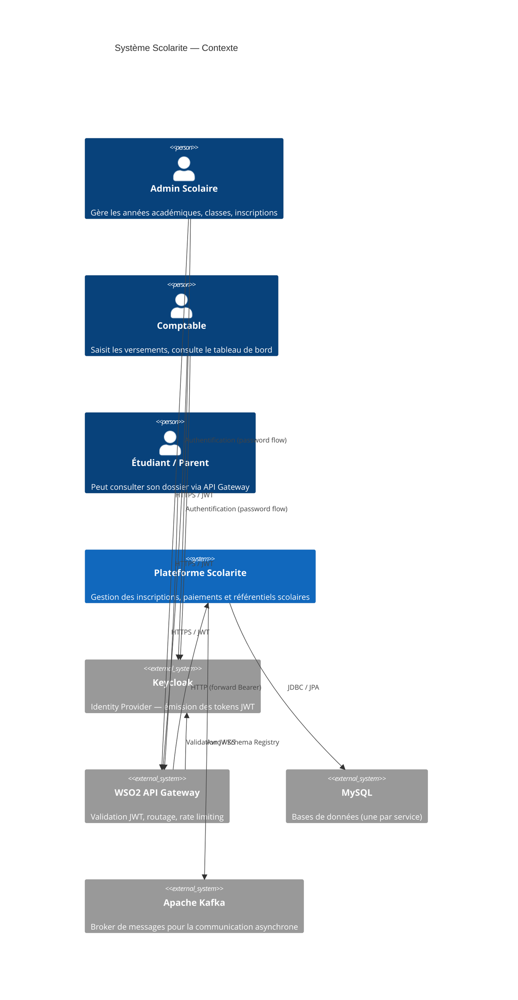
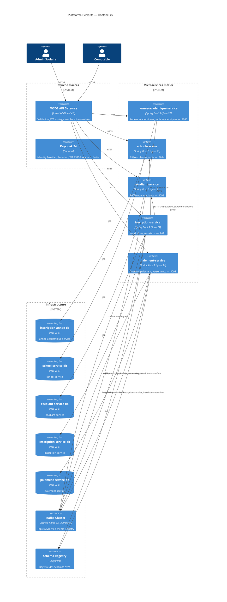

# 01 — Contexte système (C4 Level 1 & 2)

## Vue d'ensemble

La plateforme **Scolarite** est un système de gestion scolaire qui couvre le cycle de vie complet d'un étudiant :
inscription → paiement des frais → suivi comptable → transfert de classe.

Elle est construite comme un ensemble de **microservices autonomes**, communiquant via REST (synchrone) et Kafka (asynchrone), derrière un API Gateway WSO2.

---

## C4 — Niveau 1 : Contexte système

---

## C4 — Niveau 2 : Conteneurs

---

## Principes directeurs

| Principe | Application |
|----------|-------------|
| **Isolation des données** | Chaque service possède sa propre base MySQL — aucune jointure inter-service |
| **Communication asynchrone préférée** | Kafka pour tout ce qui ne nécessite pas de réponse immédiate |
| **Communication synchrone minimale** | REST uniquement pour les lookups bloquants (tarif, création étudiant) |
| **Pas de couplage fort** | Aucun service n'importe les classes d'un autre service |
| **Sécurité périmétrique** | JWT validé à l'entrée (WSO2), re-validé dans chaque service Spring Security |
| **Observabilité** | Actuator + Prometheus + Grafana sur chaque service |

---

## Ports réseau

| Service | Port HTTP | Base de données |
|---------|-----------|----------------|
| `annee-academique-service` | 8080 | `annee-academique-service` |
| `inscrption-service` | 8091 | `inscription-service` |
| `etudiant-service` | 8092 | `etudiant-service` |
| `paiement-service` | 8093 | `paiement-service` |
| `school-service` | 8094 | `school-service` |
| Keycloak | 8180 | — |
| WSO2 Gateway HTTP | 8280 | — |
| WSO2 Gateway HTTPS | 8243 | — |
| Kafka broker 1 | 19092 | — |
| Schema Registry | 8081 | — |
| Grafana | 3001 | InfluxDB :8086 |
| Prometheus | 9090 | — |
