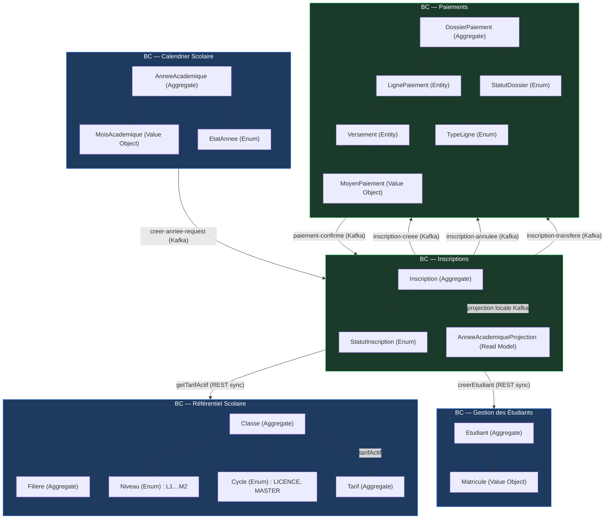

# 02 — Bounded Contexts (DDD)

## Carte des contextes délimités



---

## Définition de chaque Bounded Context

### BC1 — Calendrier Scolaire (`annee-academique-service`)

**Responsabilité :** cycle de vie d'une année académique et de ses mois.

**Langage ubiquitaire :**

| Terme | Définition |
|-------|-----------|
| Année académique | Période scolaire identifiée par un code (ex: `2025-2026`) |
| Mois académique | Un mois (mois + année calendaire) pendant lequel des cours ont lieu |
| Ouverture des inscriptions | Transition d'état qui permet aux administrateurs de créer des inscriptions |
| Clôture | Fin définitive de l'année — aucune modification possible |

**États :**
```
CREEE → PUBLIEE → INSCRIPTIONS_OUVERTES → INSCRIPTIONS_FERMEES → CLOTUREE
```

---

### BC2 — Référentiel Scolaire (`school-service`)

**Responsabilité :** structure pédagogique (filières, classes, tarification).

**Langage ubiquitaire :**

| Terme | Définition |
|-------|-----------|
| Filière | Domaine d'études (ex: Informatique, Gestion) |
| Classe | Promotion d'une filière à un niveau donné (ex: L1-INFO-2025) |
| Niveau | Rang dans le cursus : L1, L2, L3, M1, M2 |
| Tarif | Grille tarifaire : frais inscription + mensualité + autres frais |
| Tarif actif | Un seul tarif actif par classe à un instant donné |

**Invariant métier :** une classe ne peut avoir qu'un seul tarif actif simultanément.

---

### BC3 — Gestion des Étudiants (`etudiant-service`)

**Responsabilité :** référentiel des personnes inscrites dans l'établissement.

**Langage ubiquitaire :**

| Terme | Définition |
|-------|-----------|
| Étudiant | Personne physique identifiée par un UUID et un matricule |
| Matricule | Identifiant métier unique généré séquentiellement (ex: `ETU-00042`) |
| Étudiant nouveau | Étudiant créé lors de l'inscription (flag `etudiantNouveau`) |

**Note saga :** un étudiant nouveau créé lors d'une inscription ratée est supprimé physiquement (compensation). Un étudiant existant n'est jamais supprimé lors d'une annulation.

---

### BC4 — Inscriptions (`inscrption-service`)

**Responsabilité :** orchestration du processus d'inscription et gestion de son cycle de vie.

**Langage ubiquitaire :**

| Terme | Définition |
|-------|-----------|
| Inscription | Engagement d'un étudiant dans une classe pour une année académique |
| PENDING | Inscription créée, dossier paiement en cours d'initialisation |
| CONFIRMEE | Premier versement encaissé |
| ANNULEE | Annulation administrative avant tout versement (soft delete) |
| Transfert de classe | Changement de classe pour une inscription CONFIRMEE, vers une classe L1 ou M1, dans le délai imparti |
| Projection locale | Copie locale de l'état des années académiques (alimentée par Kafka) |

**Règles métier clés :**
- Une inscription CONFIRMEE ne peut pas être annulée
- Un transfert n'est possible que vers L1 ou M1, dans les 3 mois suivant la création
- L'admin crée l'inscription sans saisir de montant — c'est le comptable qui saisit les versements

---

### BC5 — Paiements (`paiement-service`)

**Responsabilité :** gestion financière des dossiers de paiement associés aux inscriptions.

**Langage ubiquitaire :**

| Terme | Définition |
|-------|-----------|
| Dossier paiement | Ensemble des obligations financières d'un étudiant pour une inscription |
| Ligne paiement | Une obligation unitaire (frais inscription, mensualité, autres frais) |
| Versement | Paiement partiel ou total d'une ligne |
| Moyen de paiement | Mode de règlement : COMPTANT, MOBILE_MONEY, BANQUE, TRANSFERT |
| Distribution automatique | Répartition d'un montant global sur les lignes dans l'ordre de priorité |
| Transfert | Report intégral du solde payé vers un nouveau dossier après changement de classe |
| Ordre de règlement | Priorité de paiement : FRAIS_INSCRIPTION > AUTRES_FRAIS > MENSUALITES (Juin→Mai) |

**Invariant :** le premier versement doit couvrir au minimum `fraisInscription + autresFrais + 1 mensualité`.

---

## Relations inter-contextes

| Relation | Type | Sens | Détail |
|----------|------|------|--------|
| Calendrier → Inscriptions | Kafka (Published Language) | `creer-annee-request` | La projection locale dans inscription-service est alimentée |
| Inscriptions → Référentiel | REST (Customer/Supplier) | `getTarifActif` | Inscriptions consomme, school-service fournit |
| Inscriptions → Étudiants | REST (Customer/Supplier) | `creerEtudiant`, `supprimerEtudiant` | Inscriptions orchestre, etudiant-service exécute |
| Inscriptions → Paiements | Kafka (Published Language) | `inscription-creee/annulee/transfere` | Paiements réagit aux événements d'inscription |
| Paiements → Inscriptions | Kafka (Published Language) | `paiement-confirme` | Inscriptions réagit à la confirmation de paiement |

**Pattern de traduction :** chaque service traduit les modèles Avro reçus en commandes de son propre domaine — aucune fuite de modèle entre contextes.
