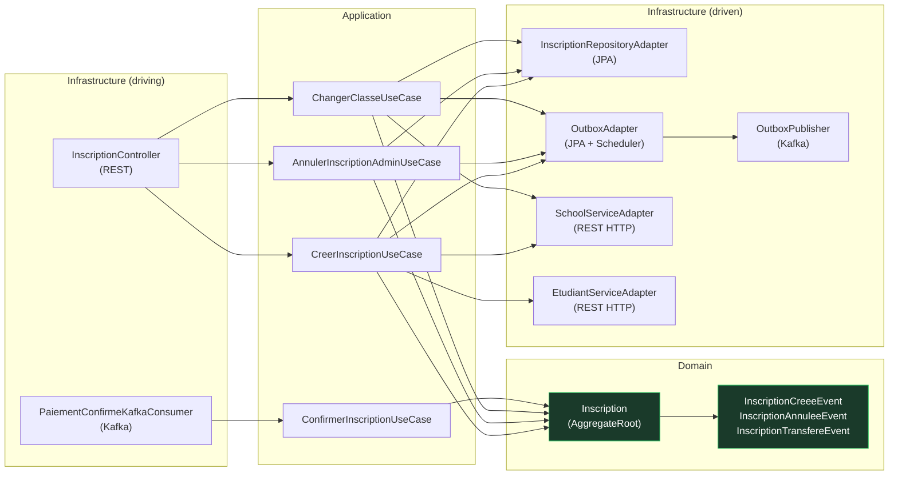

# 03 — Architecture Hexagonale

## Principe

Chaque microservice suit le pattern **Ports & Adapters** (Architecture Hexagonale) : le domaine métier est au centre, sans aucune dépendance vers les frameworks ou l'infrastructure. Les adapters traduisent les protocoles externes (HTTP, Kafka, JPA) en appels vers les ports.

```
          ┌─────────────────────────────────────────────┐
          │           Adapters primaires (driving)       │
          │   REST Controller │ Kafka Consumer           │
          └────────────┬──────────────────┬─────────────┘
                       │ Port In          │ Port In
          ┌────────────▼──────────────────▼─────────────┐
          │                  APPLICATION                  │
          │          Use Cases (services)                 │
          │   CreerInscriptionService                     │
          │   DistribuerVersementService                  │
          │   TransfererDossierService  ...               │
          └────────────┬──────────────────┬─────────────┘
                       │ Port Out         │ Port Out
          ┌────────────▼──────────────────▼─────────────┐
          │           Adapters secondaires (driven)       │
          │  JPA Repository │ HTTP Client │ Outbox        │
          └─────────────────────────────────────────────┘
```

**Règle d'or :** les flèches de dépendance pointent **toujours vers le domaine**, jamais vers l'extérieur.

---

## Structure de package appliquée

```
{service}/
└── src/main/java/com/ecole221/{nom}/service/
    ├── domain/
    │   ├── model/          ← Agrégats, Entités, Value Objects
    │   ├── event/          ← Domain Events
    │   ├── exception/      ← Exceptions métier
    │   └── valueobject/    ← Enums, types valeur
    ├── application/
    │   ├── port/
    │   │   ├── in/         ← Use Case interfaces (ports primaires)
    │   │   └── out/        ← Repository/Service interfaces (ports secondaires)
    │   ├── usecase/        ← Implémentations des Use Cases
    │   └── command/        ← Objets de commande (records immuables)
    └── infrastructure/
        ├── web/
        │   ├── controller/ ← Adapters REST (primaires)
        │   ├── dto/        ← Request / Response DTOs
        │   └── config/     ← SecurityConfig, OpenApiConfig
        ├── kafka/
        │   └── consumer/   ← Adapters Kafka consommateurs (primaires)
        ├── persistence/
        │   ├── entity/     ← Entités JPA (adapters secondaires)
        │   ├── repository/ ← Spring Data JPA interfaces
        │   ├── adapter/    ← Implémentation des ports out
        │   ├── mapper/     ← Traduction Domain ↔ JPA
        │   └── outbox/     ← Outbox (entity, publisher, scheduler)
        └── http/           ← Clients HTTP (appels REST sortants)
```

---

## Couche Domain — règles absolues

| Règle | Raison |
|-------|--------|
| Zéro import Spring / JPA / Jackson | Le domaine est testable sans conteneur |
| Zéro accès à la base de données | Toute persistance passe par un port out |
| Zéro appel réseau | Toute communication passe par un port out |
| Les agrégats émettent des DomainEvents | Via `AggregateRoot.addEvent()` — les services les récupèrent via `pullDomainEvents()` |
| Les factory methods sont nommées `creer()` et `reconstituer()` | `creer()` émet les événements, `reconstituer()` ne les émet pas (hydratation depuis DB) |

### Exemple — `Inscription` (agrégat)

```java
// Factory — émet InscriptionCreeeEvent
public static Inscription creer(UUID etudiantId, ...) {
    Inscription i = new Inscription();
    i.statut = StatutInscription.PENDING;
    i.addEvent(new InscriptionCreeeEvent(...));
    return i;
}

// Reconstitution depuis la base — aucun événement
public static Inscription reconstituer(UUID id, ...) {
    Inscription i = new Inscription();
    i.setId(id);
    // ...
    return i;
}

// Commande métier — valide les règles, émet l'événement
public void annuler(String motif) {
    if (statut == CONFIRMEE) throw new InscriptionException("...");
    statut = ANNULEE;
    addEvent(new InscriptionAnnuleeEvent(getId().toString(), LocalDateTime.now()));
}
```

---

## Couche Application — Use Cases

Les use cases sont les **seuls orchestrateurs** : ils récupèrent l'agrégat, lui délèguent la logique métier, puis persistent et publient les événements.

```java
@Transactional
public void executer(UUID inscriptionId, String motif) {
    // 1. Récupérer via port out
    Inscription inscription = inscriptionRepository.trouverParId(inscriptionId)
            .orElseThrow(...);

    // 2. Déléguer au domaine (qui valide les règles)
    inscription.annuler(motif);

    // 3. Persister via port out
    inscriptionRepository.sauvegarder(inscription);

    // 4. Publier les events via port out (Outbox)
    inscription.pullDomainEvents().forEach(outboxPort::sauvegarder);
}
```

**Interdictions dans les use cases :**
- Jamais de logique de validation métier (c'est le rôle du domaine)
- Jamais de SQL direct (c'est le rôle des adapters)
- Jamais d'accès aux DTOs web (ce sont des objets d'infrastructure)

---

## Couche Infrastructure — Adapters

### Adapter REST (primaire)

```
HTTP Request → Controller → Command → UseCase (port in)
HTTP Response ← DTO ← Domain Model ←
```

Le controller ne contient aucune logique métier. Il traduit uniquement :
- `@RequestBody` → `Command` record
- `Domain Model` → `Response` DTO

### Adapter JPA (secondaire)

```
UseCase → Port Out interface → RepositoryAdapter → JPA Entity → MySQL
                               (mapper domain↔JPA)
```

Le mapper est une classe dédiée qui traduit entre les objets domaine (pas d'annotations) et les entités JPA (avec annotations Hibernate).

### Adapter Kafka consommateur (primaire)

```
Kafka Message (Avro) → KafkaConsumer → Command → UseCase (port in)
```

### Outbox adapter (secondaire)

```
UseCase → OutboxPort → OutboxAdapter → outbox_event table
                     ← Scheduler (toutes les 5s) → KafkaProducer
```

---

## Flux de dépendances — `inscrption-service` (exemple complet)


