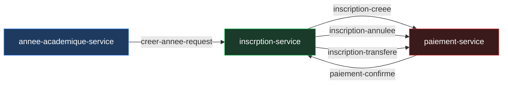

# 04 — Catalogue des événements Kafka

## Vue d'ensemble des topics



---

## Configuration Kafka

| Paramètre | Valeur |
|-----------|--------|
| Brokers | `localhost:19092`, `localhost:29092`, `localhost:39092` |
| Schema Registry | `http://localhost:8081` |
| Sérialisation | Avro (Confluent `KafkaAvroSerializer`) |
| Partitions | 3 par topic |
| Réplication | 3 |
| Producer acks | `all` (idempotent) |
| Consumer offset reset | `earliest` |
| Consumer concurrency | 3 threads |

---

## Détail des événements

### `creer-annee-request`

**Producteur :** `annee-academique-service`  
**Consommateur :** `inscrption-service`  
**Déclencheur :** publication ou modification d'une année académique

**Schéma Avro (`CreateAnneeAcademiqueAvroModel`) :**

| Champ | Type | Description |
|-------|------|-------------|
| `codeAnnee` | string | Ex : `2025-2026` |
| `etatAnnee` | string | `CREEE`, `PUBLIEE`, `INSCRIPTIONS_OUVERTES`, … |
| `moisAcademiques` | string (JSON) | Liste des mois académiques sérialisée |

**Action consommateur :** mise à jour de la projection locale `AnneeAcademiqueProjection` dans `inscrption-service`.

---

### `inscription-creee`

**Producteur :** `inscrption-service`  
**Consommateur :** `paiement-service`  
**Déclencheur :** création réussie d'une inscription (statut `PENDING`)

**Schéma Avro (`InscriptionCreeeAvroModel`) :**

| Champ | Type | Description |
|-------|------|-------------|
| `inscriptionId` | string (UUID) | Identifiant de l'inscription |
| `etudiantId` | string (UUID) | Identifiant de l'étudiant |
| `classeId` | string (UUID) | Identifiant de la classe |
| `codeAnnee` | string | Code de l'année académique |
| `fraisInscription` | string (decimal) | Montant des frais d'inscription |
| `mensualite` | string (decimal) | Montant de la mensualité |
| `autresFrais` | string (decimal) | Autres frais |
| `moisAcademiques` | string (JSON) | Liste `[{"mois":10,"annee":2025},…]` |

**Action consommateur :** initialisation du `DossierPaiement` avec génération des lignes de paiement. Si le dossier existe déjà (idempotence), le message est ignoré.

**Compensation en cas d'échec :** `paiement-service` publie `paiement-confirme{ECHEC}` → `inscrption-service` supprime l'inscription et l'étudiant si nouveau.

---

### `inscription-annulee`

**Producteur :** `inscrption-service`  
**Consommateur :** `paiement-service`  
**Déclencheur :** annulation administrative d'une inscription `PENDING`

**Schéma Avro (`InscriptionAnnuleeAvroModel`) :**

| Champ | Type | Description |
|-------|------|-------------|
| `inscriptionId` | string (UUID) | Identifiant de l'inscription annulée |

**Action consommateur :** suppression physique du `DossierPaiement` et de toutes ses données (lignes, versements, moyens) via cascade JPA.

**Garantie :** l'inscription reste en base avec statut `ANNULEE` (soft delete) ; l'étudiant est conservé.

---

### `inscription-transfere`

**Producteur :** `inscrption-service`  
**Consommateur :** `paiement-service`  
**Déclencheur :** transfert de classe d'une inscription `CONFIRMEE` vers une classe L1 ou M1

**Schéma Avro (`InscriptionTransfereAvroModel`) :**

| Champ | Type | Description |
|-------|------|-------------|
| `inscriptionId` | string (UUID) | Identifiant de l'inscription |
| `etudiantId` | string (UUID) | Identifiant de l'étudiant |
| `nouvelleClasseId` | string (UUID) | Identifiant de la nouvelle classe |
| `codeAnnee` | string | Code de l'année académique |
| `fraisInscription` | string (decimal) | Frais d'inscription de la nouvelle classe |
| `mensualite` | string (decimal) | Mensualité de la nouvelle classe |
| `autresFrais` | string (decimal) | Autres frais de la nouvelle classe |
| `moisAcademiques` | string (JSON) | Mois académiques de l'année |

**Action consommateur (`TransfererDossierService`) :**
1. Lire le `totalPayé` de l'ancien dossier
2. Supprimer l'ancien dossier (cascade)
3. Créer un nouveau dossier avec les tarifs de la nouvelle classe
4. Redistribuer le `totalPayé` sur le nouveau dossier via `appliquerTransfert()` (moyen : `TRANSFERT`)

**Note :** aucun `DossierInitialiseEvent` n'est émis lors de la redistribution — l'inscription est déjà `CONFIRMEE`.

---

### `paiement-confirme`

**Producteur :** `paiement-service`  
**Consommateur :** `inscrption-service`  
**Déclencheur :** premier versement sur un dossier `INITIALISE` → passage en `ACTIF`

**Schéma Avro (`PaiementConfirmeAvroModel`) :**

| Champ | Type | Description |
|-------|------|-------------|
| `inscriptionId` | string (UUID) | Identifiant de l'inscription |
| `statut` | string | `CONFIRME` ou `ECHEC` |
| `message` | string | Message d'erreur en cas d'échec |

**Action consommateur :**
- Si `CONFIRME` → `inscription.confirmer()` → statut `CONFIRMEE`
- Si `ECHEC` → `inscription.echouer()` → statut `ECHOUEE` + suppression étudiant si nouveau

---

## Outbox Pattern

Chaque service producteur utilise une table `outbox_event` pour garantir l'atomicité entre la modification de la base métier et la publication Kafka.

```
Transaction DB (atomique) :
  ├── INSERT/UPDATE entité métier
  └── INSERT outbox_event (status=PENDING, payload=Avro bytes)

Scheduler @Scheduled(fixedDelay=5000) :
  ├── SELECT outbox_event WHERE status IN (PENDING, FAILED)
  ├── publish → Kafka (dispatch par eventType)
  └── UPDATE status = PUBLISHED | FAILED
```

**Table `outbox_event` :**

| Colonne | Type | Description |
|---------|------|-------------|
| `id` | UUID | Identifiant |
| `aggregate_type` | VARCHAR | Ex : `Inscription` |
| `aggregate_id` | VARCHAR | UUID de l'agrégat |
| `event_type` | VARCHAR | Ex : `InscriptionCreeeEvent` |
| `payload` | BLOB | Données Avro sérialisées en bytes |
| `status` | ENUM | `PENDING`, `PUBLISHED`, `FAILED` |
| `occurred_at` | DATETIME | Timestamp de l'événement |

**Dispatch dans `inscrption-service` :**

```java
switch (event.getEventType()) {
    case "InscriptionCreeeEvent"    → topic inscription-creee
    case "InscriptionAnnuleeEvent"  → topic inscription-annulee
    case "InscriptionTransfereEvent"→ topic inscription-transfere
}
```

---

## Idempotence

| Service | Mécanisme |
|---------|-----------|
| `paiement-service` reçoit `inscription-creee` | Vérifie l'existence du dossier avant initialisation |
| `paiement-service` reçoit `inscription-annulee` | `deleteByInscriptionId` silencieux si absent |
| `inscrption-service` reçoit `paiement-confirme CONFIRME` | `confirmer()` lève une exception si déjà CONFIRMEE — idempotence à améliorer |
| Producer Kafka | `idempotence=true` + `acks=all` — pas de doublon au niveau réseau |
