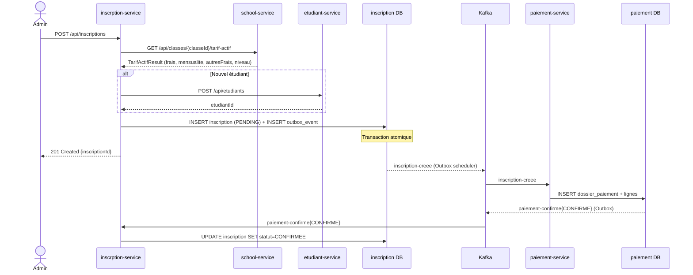
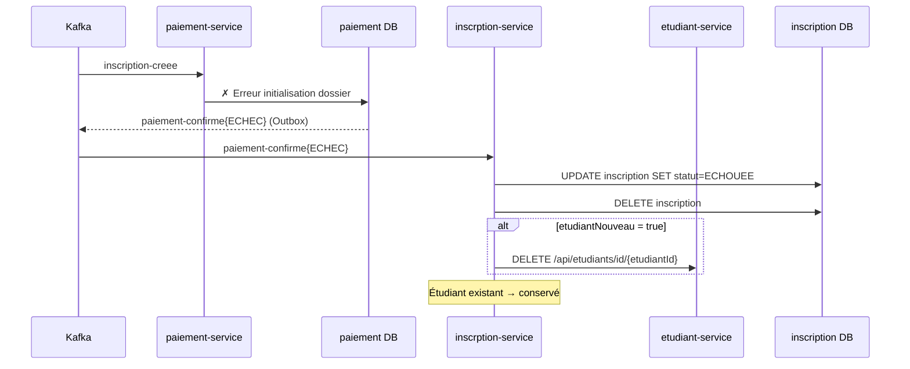
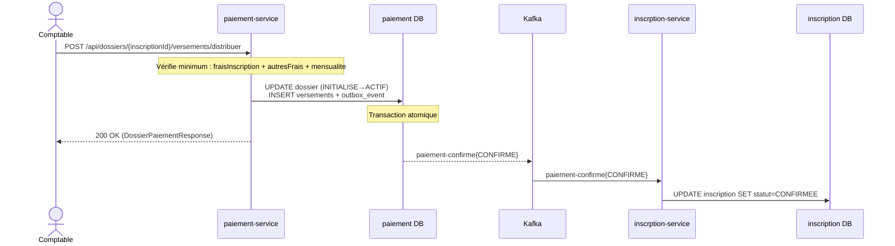
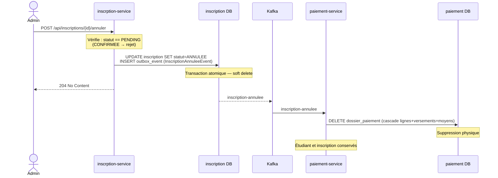
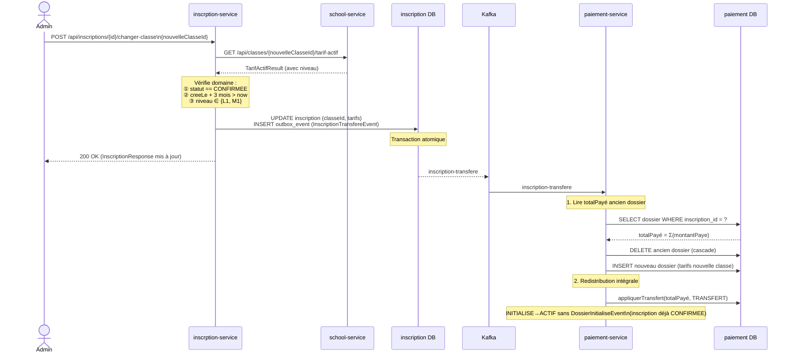
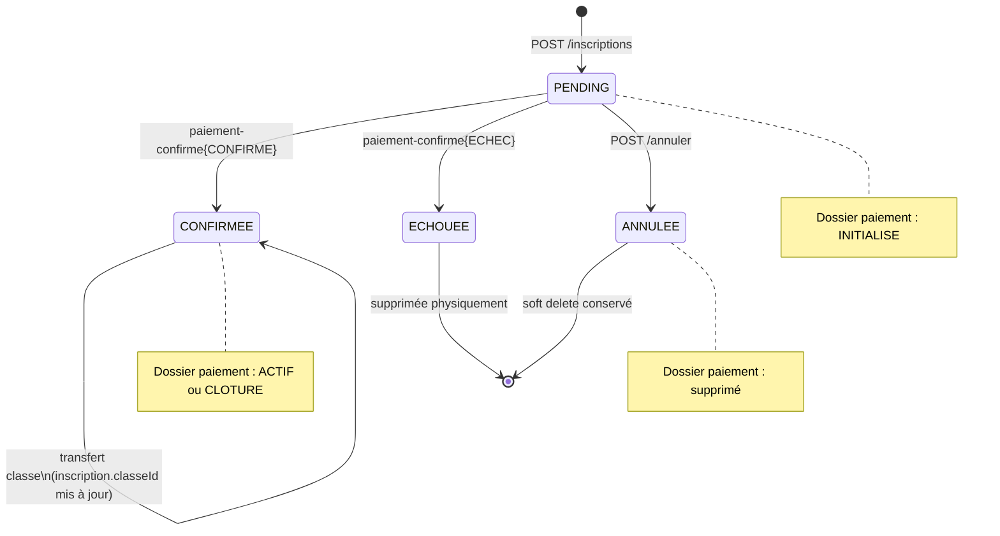

# 05 — Sagas (Choreography)

Toutes les sagas utilisent la **chorégraphie** : pas de coordinateur central. Chaque service réagit aux événements Kafka et publie le suivant. L'Outbox Pattern garantit l'atomicité locale.

---

## SAGA 1 — Création d'inscription

### Flux nominal

### Flux de compensation (échec paiement-service)

---

## SAGA 2 — Premier versement (confirmation)

---

## SAGA 3 — Annulation administrative

**Garanties :**
- L'inscription reste visible en base avec statut `ANNULEE` et `motifAnnulation`
- Si le dossier n'existe pas encore (Kafka lent), `deleteByInscriptionId` est no-op
- Si le message est rejoué (at-least-once), la suppression est idempotente

---

## SAGA 4 — Transfert de classe

**Règles métier :**

| Condition | Comportement |
|-----------|-------------|
| totalPayé > totalDû nouvelle classe | Plafonné au totalDû — surplus non remboursé automatiquement |
| totalPayé = 0 | Impossible (l'inscription est CONFIRMEE = au moins 1 versement) |
| Kafka rejoue le message | L'ancien dossier n'existe plus → `deleteByInscriptionId` no-op → nouveau dossier recréé |

---

## Garanties transactionnelles

| Propriété | Mécanisme |
|-----------|-----------|
| **Atomicité locale** | Chaque service modifie sa DB + l'Outbox dans une seule transaction |
| **At-least-once delivery** | Kafka peut re-livrer — chaque consumer gère l'idempotence |
| **Pas de transactions distribuées** | 2PC interdit — compensation saga en cas d'échec |
| **Ordre des messages** | Partitionnement par `inscriptionId` → ordre garanti pour un agrégat donné |

---

## États agrégés des sagas

