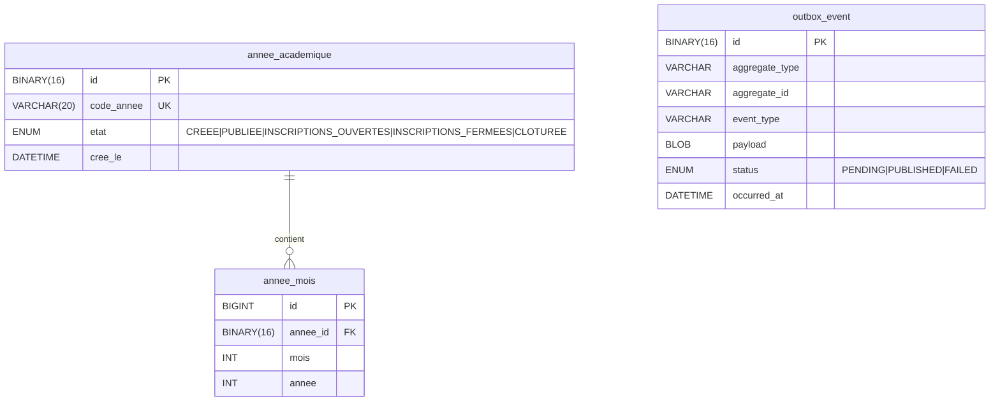
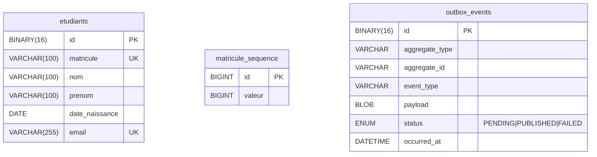

# 06 — Modèles de données

Chaque service possède sa propre base MySQL. Aucun accès direct entre bases — les données partagées passent par Kafka ou REST.

---

## `annee-academique-service`



---

## `school-service`

```mermaid
erDiagram
    filiere {
        BINARY(16) id PK
        VARCHAR(20) code UK
        VARCHAR(100) nom
    }

    classe {
        BINARY(16) id PK
        VARCHAR(20) code UK
        VARCHAR(100) nom
        ENUM cycle "LICENCE|MASTER"
        ENUM niveau "L1|L2|L3|M1|M2"
        BINARY(16) filiere_id FK
    }

    tarif {
        BINARY(16) id PK
        DECIMAL(15,2) frais_inscription
        DECIMAL(15,2) mensualite
        DECIMAL(15,2) autres_frais
    }

    classe_tarif {
        BINARY(16) classe_id FK
        BINARY(16) tarif_id FK
        DATE date_activation
        DATE date_desactivation
        BOOLEAN actif
    }

    school_outbox_event {
        BINARY(16) id PK
        VARCHAR event_type
        BLOB payload
        ENUM status "PENDING|PUBLISHED|FAILED"
        DATETIME occurred_at
    }

    filiere ||--o{ classe : "contient"
    classe ||--o{ classe_tarif : "a"
    tarif ||--o{ classe_tarif : "est affecté à"
```

**Invariant :** `actif = true` pour au plus un `classe_tarif` par `classe_id` à un instant donné.

---

## `etudiant-service`



**Génération du matricule :** séquence globale en base → `ETU-{valeur:05d}`.

---

## `inscrption-service`

```mermaid
erDiagram
    inscription {
        BINARY(16) id PK
        BINARY(16) etudiant_id
        BINARY(16) classe_id
        VARCHAR(20) code_annee
        DECIMAL(15,2) frais_inscription
        DECIMAL(15,2) mensualite
        DECIMAL(15,2) autres_frais
        TEXT mois_academiques_json
        ENUM statut "PENDING|CONFIRMEE|ECHOUEE|ANNULEE"
        BOOLEAN etudiant_nouveau
        DATETIME cree_le
        DATETIME annule_le
        VARCHAR(500) motif_annulation
    }

    annee_academique_projection {
        BINARY(16) id PK
        VARCHAR(20) code_annee UK
        ENUM etat_annee "CREEE|PUBLIEE|INSCRIPTIONS_OUVERTES|INSCRIPTIONS_FERMEES|CLOTUREE"
        TEXT mois_academiques_json
    }

    outbox_event {
        BINARY(16) id PK
        VARCHAR aggregate_type
        VARCHAR aggregate_id
        VARCHAR event_type "InscriptionCreeeEvent|InscriptionAnnuleeEvent|InscriptionTransfereEvent"
        BLOB payload
        ENUM status "PENDING|PUBLISHED|FAILED"
        DATETIME occurred_at
    }
```

**Notes :**
- `etudiant_id` et `classe_id` sont des références logiques (pas de FK inter-service)
- `mois_academiques_json` : `[{"mois":10,"annee":2025},{"mois":11,"annee":2025},…]`
- `annee_academique_projection` est alimentée par Kafka (`creer-annee-request`) — copie locale pour éviter l'appel synchrone à `annee-academique-service`
- `etudiant_nouveau = true` → cet étudiant a été créé lors de cette inscription (eligible à la compensation)

---

## `paiement-service`

```mermaid
erDiagram
    dossier_paiement {
        BINARY(16) id PK
        BINARY(16) inscription_id UK
        BINARY(16) etudiant_id
        BINARY(16) classe_id
        VARCHAR(20) code_annee
        DECIMAL(15,2) frais_inscription
        DECIMAL(15,2) mensualite
        DECIMAL(15,2) autres_frais
        ENUM statut "INITIALISE|ACTIF|CLOTURE"
    }

    ligne_paiement {
        BINARY(16) id PK
        BINARY(16) dossier_id FK
        ENUM type "FRAIS_INSCRIPTION|AUTRES_FRAIS|MENSUALITE"
        INT mois_academique_mois
        INT mois_academique_annee
        INT ordre_reglement
        DECIMAL(15,2) montant_du
        DECIMAL(15,2) montant_paye
        TEXT commentaire
        ENUM statut "APAYER|AVANCE|PAYE"
    }

    versement {
        BINARY(16) id PK
        BINARY(16) ligne_id FK
        DECIMAL(15,2) montant
        DATE date_paiement
        BINARY(16) moyen_id FK
    }

    moyen_paiement {
        BINARY(16) id PK
        ENUM type "MOBILE_MONEY|BANQUE|COMPTANT|TRANSFERT"
        VARCHAR operateur
        VARCHAR reference_paiement
        VARCHAR nom_banque
        VARCHAR numero_transaction
    }

    outbox_event {
        BINARY(16) id PK
        VARCHAR event_type "DossierInitialiseEvent"
        BLOB payload
        ENUM status "PENDING|PUBLISHED|FAILED"
        DATETIME occurred_at
    }

    dossier_paiement ||--o{ ligne_paiement : "contient (cascade ALL)"
    ligne_paiement ||--o{ versement : "reçoit (cascade ALL)"
    versement ||--|| moyen_paiement : "utilise (cascade ALL)"
```

**Cascade JPA :** `dossier_paiement` → `ligne_paiement` → `versement` → `moyen_paiement`.  
La suppression d'un dossier (annulation ou transfert) supprime physiquement toute la hiérarchie.

### Ordre de règlement des lignes

| Type | Ordre |
|------|-------|
| `FRAIS_INSCRIPTION` | -2 (priorité absolue) |
| `AUTRES_FRAIS` | -1 |
| Mensualité Juin | 1 |
| Mensualité Octobre | 2 |
| Mensualité Novembre | 3 |
| Mensualité Décembre | 4 |
| Mensualité Janvier | 5 |
| Mensualité Février | 6 |
| Mensualité Mars | 7 |
| Mensualité Avril | 8 |
| Mensualité Mai | 9 |

### Historique des versements (commentaire)

Chaque versement appende une entrée horodatée dans `ligne_paiement.commentaire` :

```
Octobre 2025 | 03/06/2026 : versé 80000 via MOBILE_MONEY [avance — restant : 10000]
             | 04/06/2026 : versé 10000 via COMPTANT [PAYÉ intégralement]
Novembre 2025 | 15/06/2026 : versé 80000 via TRANSFERT [PAYÉ intégralement]
```
