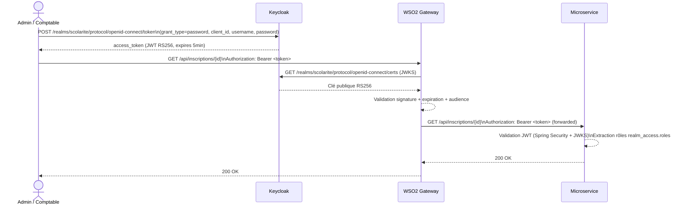

# 07 — Architecture de sécurité

## Vue d'ensemble



---

## Keycloak — Realm `scolarite`

### Clients

| Client | Usage | Flows |
|--------|-------|-------|
| `client-frontend` | Applications clientes (Swagger, mobile, web) | Standard flow, Direct access grants |
| `wso2-dcr` | WSO2 Key Manager | Client credentials, Service accounts |

**Web Origins `client-frontend` :** `http://localhost:8080`, `http://localhost:8091`, `http://localhost:8092`, `http://localhost:8093`, `http://localhost:8094` (nécessaire pour Swagger OAuth2 CORS).

### Rôles du realm

| Rôle | Description |
|------|-------------|
| `super` | Accès total (GET, POST, PUT, DELETE) |
| `admin` | Gestion courante (GET, POST, PUT) |
| `user` | Lecture seule (GET) |

### Utilisateurs

| Utilisateur | Rôles |
|-------------|-------|
| `baye` | `super`, `admin`, `user` |
| `mouha` | `admin`, `user` |
| `barham` | `user` |

### Format du token JWT

```json
{
  "iss": "http://keycloak:8180/realms/scolarite",
  "sub": "uuid-utilisateur",
  "realm_access": {
    "roles": ["super", "admin", "user"]
  },
  "preferred_username": "baye",
  "exp": 1718000000
}
```

---

## WSO2 API Gateway

### Configuration Keycloak Key Manager

```
Type          : Keycloak
Well-known    : http://keycloak:8180/realms/scolarite/.well-known/openid-configuration
Self Validate : true (valide le JWT en local, sans introspection)
Client ID     : wso2-dcr
```

### Patch obligatoire — forward Bearer token

```bash
echo -e '\n[apim.oauth_config]\nenable_outbound_auth_header = true' \
  >> /home/wso2carbon/wso2am-4.7.0/repository/conf/deployment.toml
```

Sans ce patch, WSO2 consomme le token et ne le transmet pas aux backends — Spring Security reçoit des requêtes non authentifiées (403).

### Endpoints backend (configuration API)

| API | Backend URL |
|-----|------------|
| `annee-academique-service` | `http://host.docker.internal:8080` |
| `inscrption-service` | `http://host.docker.internal:8091` |
| `etudiant-service` | `http://host.docker.internal:8092` |
| `paiement-service` | `http://host.docker.internal:8093` |
| `school-service` | `http://host.docker.internal:8094` |

> Sur Linux : `172.17.0.1` à la place de `host.docker.internal`

---

## Spring Security — Configuration par service

### Validation JWT

```yaml
spring:
  security:
    oauth2:
      resourceserver:
        jwt:
          jwk-set-uri: http://keycloak:8180/realms/scolarite/protocol/openid-connect/certs
          issuer-uri: http://keycloak:8180/realms/scolarite
```

> **Note :** l'URI JWKS pointe vers `keycloak` (hostname Docker interne) — résolu par le broker Kafka et par Spring dans le réseau Docker. Depuis le navigateur, utiliser `localhost:8180`.

### Extraction des rôles depuis `realm_access`

```java
private Collection<GrantedAuthority> extractRoles(Jwt jwt) {
    Map<String, Object> realmAccess = jwt.getClaimAsMap("realm_access");
    List<String> roles = (List<String>) realmAccess.get("roles");
    return roles.stream()
            .map(role -> new SimpleGrantedAuthority("ROLE_" + role))
            .collect(Collectors.toList());
}
```

### Matrice de droits par service

| Service | POST / PUT | DELETE | GET |
|---------|-----------|--------|-----|
| `annee-academique-service` | `ROLE_super` | — | `ROLE_admin`, `ROLE_super` |
| `school-service` | `ROLE_super` | `ROLE_super` | `ROLE_admin`, `ROLE_super`, `ROLE_user` |
| `etudiant-service` | `ROLE_admin`, `ROLE_super` | `ROLE_super` | `ROLE_admin`, `ROLE_super`, `ROLE_user` |
| `inscrption-service` | `ROLE_admin`, `ROLE_super` | `ROLE_super` | `ROLE_admin`, `ROLE_super`, `ROLE_user` |
| `paiement-service` | `ROLE_admin`, `ROLE_super` | — | `ROLE_admin`, `ROLE_super`, `ROLE_user` |

### Endpoints publics (sans authentification)

```java
.requestMatchers("/swagger-ui/**", "/v3/api-docs/**", "/swagger-ui.html").permitAll()
.requestMatchers("/actuator/**").permitAll()
```

Les endpoints Actuator sont publics pour permettre le scraping Prometheus sans token.

---

## Propagation du token vers les services appelés

Quand `inscrption-service` appelle `school-service` ou `etudiant-service` en HTTP, il propage le token JWT de l'utilisateur courant via un intercepteur `RestTemplate` :

```java
.interceptors((request, body, execution) -> {
    Authentication auth = SecurityContextHolder.getContext().getAuthentication();
    if (auth instanceof JwtAuthenticationToken jwtAuth) {
        request.getHeaders().set(
            HttpHeaders.AUTHORIZATION,
            "Bearer " + jwtAuth.getToken().getTokenValue()
        );
    }
    return execution.execute(request, body);
})
```

---

## Swagger UI — Authentification OAuth2

Chaque service expose un formulaire OAuth2 Password Flow dans Swagger :

```
URL token : ${app.keycloak.public-url}/realms/${app.keycloak.realm}/protocol/openid-connect/token
```

La propriété `app.keycloak.public-url` est configurable par variable d'environnement `APP_KEYCLOAK_PUBLIC_URL` pour supporter les environnements Docker où `keycloak` n'est pas résolvable depuis le navigateur.

**Utilisation :**
1. Ouvrir `http://localhost:8091/swagger-ui/index.html`
2. Cliquer **Authorize**
3. Renseigner `client_id=client-frontend`, `username`, `password`
4. Les requêtes suivantes incluent automatiquement `Authorization: Bearer <token>`
